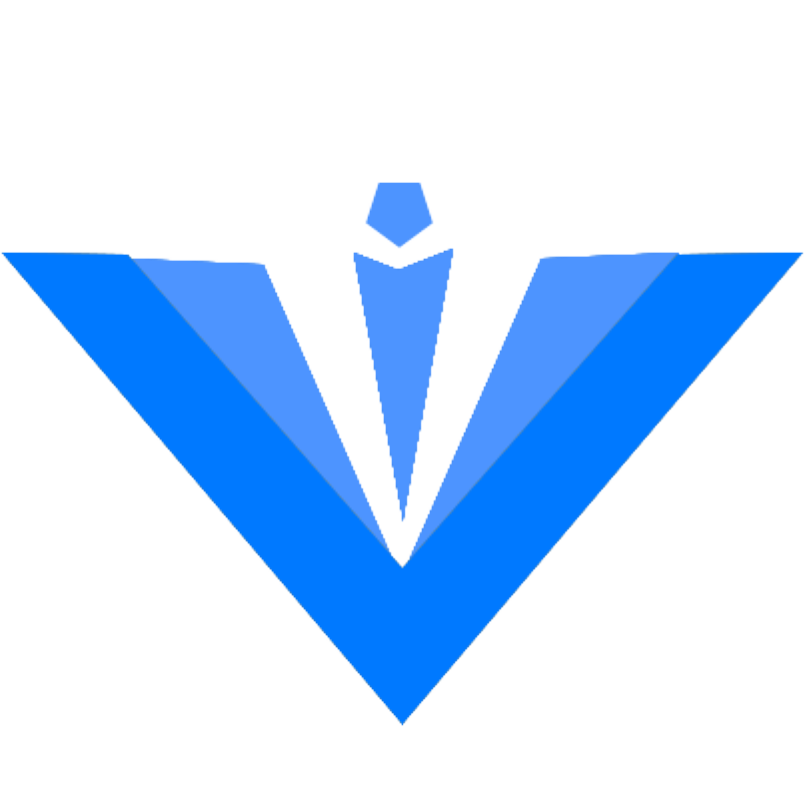

<div align="center">


{:height="40%" width="40%"}

<h1>云墨UI</h1>

<div style="display: flex; justify-content: center; align-items: center;gap: 10px;">

<a href="https://www.npmjs.com/package/guyan-ym-ui"></a> 

<a href="https://www.npmjs.com/package/guyan-ym-ui"></a> 

<a href="https://www.npmjs.com/package/guyan-ym-ui"></a> 

</div>

<h4>最新个人开发的一套基于Vue3 + Ts UI的组件库</h4>

</div>

**一个专为开发者设计**的、功能全面且高度可定制的组件库，旨在帮助您以前所未有的速度和效率构建下一代Web应用。


- **组件文档地址**: [https://guyan-tttt.github.io/guyan-ym-ui/](https://guyan-tttt.github.io/guyan-ym-ui/)
- **github地址**：[https://github.com/guyan-tttt/guyan-ym-ui](https://github.com/guyan-tttt/guyan-ym-ui)
- **gitee地址**：[https://gitee.com/DT-guyan/yunmo-ui](https://gitee.com/DT-guyan/yunmo-ui)

**更多详细用法请参考组件文档使用**

## 安装

```bash
npm i guyan-ym-ui --save
```

## 开始使用

**全局使用**


```js
// 引入所有组件
import YmUI from 'guyan-ym-ui'
// 引入样式
import 'guyan-ym-ui/dist/index.css'

import App from './App.vue'
// 全局使用
createApp(App).use(YmUI).mount('#app')
```

```html
<template>
  <ym-button>Button按钮</ym-button>
</template>
```

**单个导入**

Ym-UI 提供了基于 ES Module 的开箱即用的 Tree Shaking 功能。


```html
<template>
  <ym-button>Button</ym-button>
</template>
<script>
  import { YmButton } from ' guyan-ym-ui'
  import "guyan-ym-ui/dist/theme/Button.css" // 引入单个样式
  // import "guyan-ym-ui/dist/index.css" // 引入所有样式 或者在main.js中全局引入

  export default {
    components: { YmButton },
  }
</script>
```

## 亮点

::: details
- Vite + Vitest + Vitepress 工具链
- monorepo 分包管理
- 大模型辅助：使用大模型辅助完成需求分析，设计思路，快速实现组件，提升开发效率。
- Vue3 + Typescript + Composition API 
:::

* 亮点1 🔥： 高效的开发体验：
Vite 提供了快速的开发服务器和构建指令，支持原生 ES 模块和模块热更新（HMR），显著提升了开发体验。

* 亮点2 💧: 开箱即用的配置：
- Vite 意在提供开箱即用的配置，同时其插件 API 和 JavaScript API 带来了高度的可扩展性，并有完整的类型支持。

* 亮点3 ⛑️:monorepo 分包管理：
-使用 monorepo 方式组织项目代码，便于代码复用和独立部署，减少了代码库膨胀和性能下降的问题。

* 亮点4 📚：大模型辅助开发：
- 利用大模型辅助完成需求分析和设计思路，快速实现组件，提升开发效率。

* 亮点5 🎉：类型安全：
- 支持 TypeScript，为组件库提供类型定义，增强了代码的健壮性和可维护性，同时提升了开发体验。

* 亮点6 🌹： 易于扩展和维护：
- 组件库开发更适合 monorepo 单一代码库的方式，便于统一代码风格和构建流程，统一生成 changeLog。

* 亮点7 📚: 社区支持和生态系统：
- Vite 正在推动 Web 框架的新一轮创新竞赛，拥有庞大的生态系统和社区支持。


